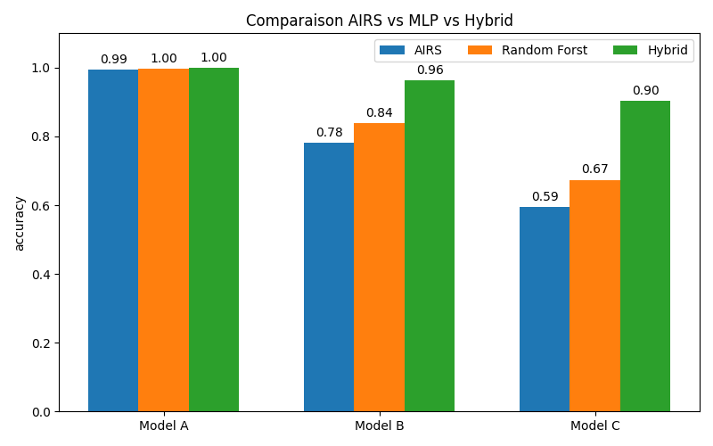

# DDoS Attack classifier with Machine Learning
this represents a study to findout the best machine learning methode to classify between network traffic samles
**dataset :** `cic_ddos_2019 dataset`
**Algorithms :**
- Artificial Immune Recognition System (AIRS)
- Random Forst
- Hybrid (between AIRS and RF)

## Hybrid Model
this model uses both AIRS algorithm and Random Forst
- AIRS algorithm is used to generate a MemoryCell pool, this pool represents the usefull parts of the dataset that contains the most informations for classification
- Random Forst is trained on the MemoryCell pool and uesd to output the final classification
- Before classification of any new sample, it is assimilated to the closest sample from the MemoryCell pool (the one with the highest affinity)

## Results
Hybrid model gives much better results that each other algorithm used seperatly
